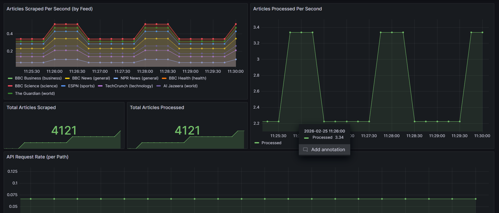
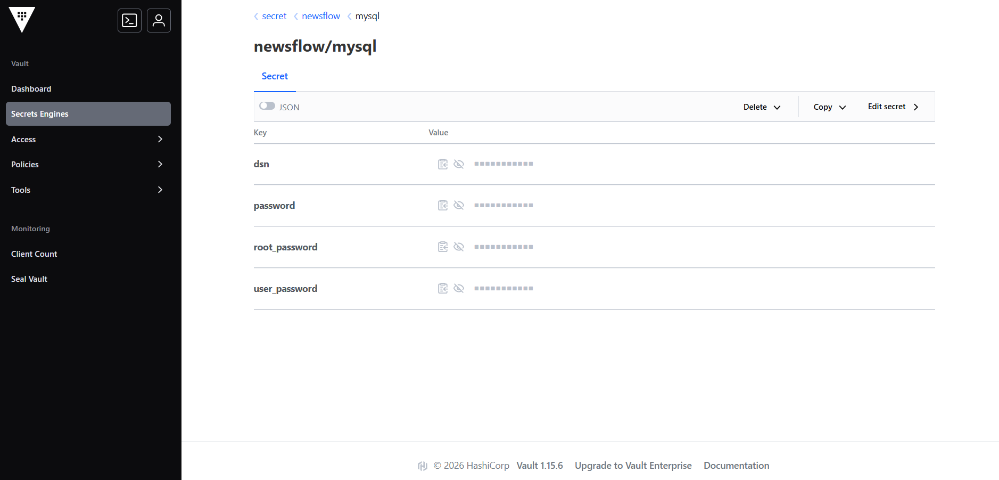

# NewsFlow

News aggregator that scrapes RSS feeds from 9 sources, streams them through RedPanda, stores everything in MySQL, and serves it all through a Go API with a web frontend. Runs on Kubernetes (Minikube) with Vault handling secrets and Prometheus + Grafana for monitoring.

## How it works

The pipeline is pretty straightforward:

1. **Scraper service** pulls RSS feeds every 2 minutes from sources like BBC, Guardian, Al Jazeera, NPR, TechCrunch, ESPN, etc.
2. Articles get published to a RedPanda topic (`raw-articles`)
3. **Processor service** consumes from that topic, deduplicates by URL, and writes to MySQL
4. **API service** serves the articles through a REST API — also has a web dashboard baked in

```
RSS Feeds → Scraper → RedPanda → Processor → MySQL → API → Web UI
```

Vault sits alongside everything and handles the MySQL credentials. Services authenticate with Vault using their K8s service account tokens (via init containers), so no secrets end up hardcoded anywhere.

Prometheus scrapes metrics from all three services using pod annotations, and Grafana is set up for dashboards.

## What you need

- [Minikube](https://minikube.sigs.k8s.io/docs/start/)
- [kubectl](https://kubernetes.io/docs/tasks/tools/)
- [Docker](https://docs.docker.com/get-docker/)
- Python 3 (the deploy script uses it to parse Vault's JSON output)

## Running it

Start minikube and enable ingress:

```bash
minikube start
minikube addons enable ingress
```

Build the images inside minikube's Docker so the cluster can pull them:

```bash
eval $(minikube docker-env)

docker build -t news-scraper:latest   services/scraper-service/
docker build -t news-processor:latest services/processor-service/
docker build -t news-api:latest       services/api-service/
```

Then just run the deploy script. It sets up everything in order — namespaces, Vault (init, unseal, secrets, policies), MySQL, RedPanda, the three services, ingress, and monitoring:

```bash
./deploy.sh
```

Once it's done, port-forwards start automatically:

- **Dashboard** — http://localhost:8080/user/
- **Vault UI** — http://localhost:8200
- **Grafana** — http://localhost:3000

To tear it all down:

```bash
./cleanup.sh
```

## API

All routes are under `/user/api/`:

```
Ingress : /user/*
GET /user/api/articles          — list articles (query params: search, category, source, page, per_page)
GET /user/api/articles/{id}     — single article
GET /user/api/categories        — all categories
GET /user/api/sources           — all sources
GET /user/api/stats             — aggregate stats
GET /user/api/health            — health check
GET /metrics                    — prometheus metrics
```

## Project layout

```
deploy.sh                       — deploys the whole stack
cleanup.sh                      — tears everything down
db/init.sql                     — MySQL schema

k8s/
  namespaces.yaml               — one namespace per component
  mysql.yaml                    — MySQL deployment
  redpanda.yaml                 — RedPanda broker + topic init
  services.yaml                 — scraper, processor, API deployments
  ingress.yaml                  — routes /user/ to the API
  monitoring.yaml               — Prometheus + Grafana
  vault/
    vault.yaml                  — Vault StatefulSet
    newsflow-read.hcl           — read policy for the newsflow secret path

services/
  scraper-service/              — RSS scraper, publishes to RedPanda (Go)
  processor-service/            — consumes from RedPanda, writes to MySQL (Go)
  api-service/                  — REST API + embedded web frontend (Go)
```

Each service lives in its own K8s namespace (`news-scraper`, `news-processor`, `news-api`). Infrastructure gets its own namespaces too — `news-mysql`, `news-redpanda`, `vault`, `monitoring`.

## Monitoring

Services expose these custom Prometheus metrics:

- `scraper_articles_scraped_total` — counter, broken down by feed and category
- `processor_articles_processed_total` — counter, articles written to MySQL
- `http_requests_total` — counter, API requests by path and method
- `http_request_duration_seconds` — histogram, API latency

Prometheus auto-discovers targets through pod annotations — any pod with `prometheus.io/scrape: "true"` gets picked up.



## How secrets work

Didn't want to put DB credentials in env vars or ConfigMaps, so services that talk to MySQL use Vault with Kubernetes auth. The flow is:

1. Pod starts, init container reads the K8s service account JWT
2. Exchanges it with Vault for a token (using the `newsflow-role`)
3. Pulls the MySQL DSN from `secret/newsflow/mysql`
4. Writes it to a shared emptyDir volume
5. Main container reads it from there on startup

The Vault policy (`newsflow-read.hcl`) only gives read access to `secret/newsflow/*`.


